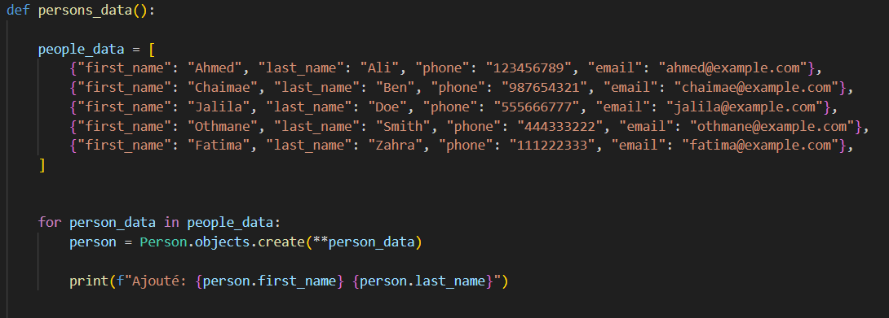
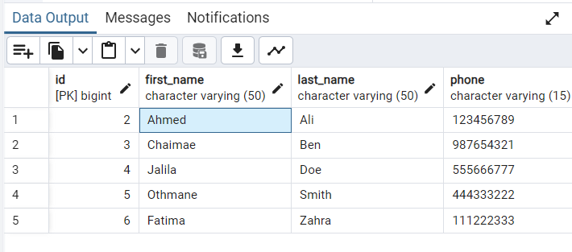
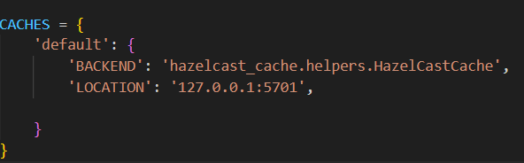
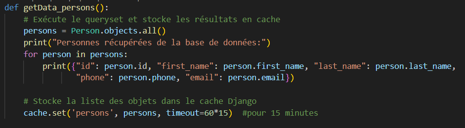
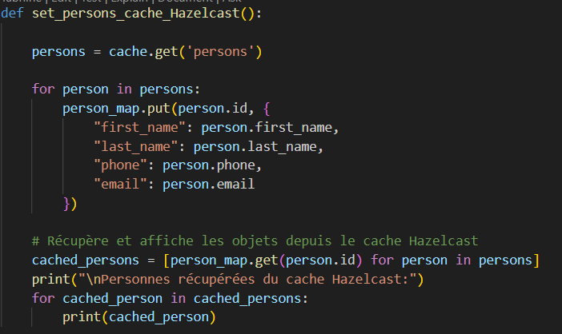

<h1>Comment Django interagit avec le cache?</h1>

Nous allons tester ce que fait Django avec le cache lorsqu'un queryset est executé et chercher un element specifique dans une structure de données Hazelcast en utilisant PostgreSQL.
 
Nous allons principalement utiliser la structure Map
 

Nous allons creer un model "Person"(first_name, last_name,phone, email) et inserer des objects dans la base de données :
 

  
Ce code fait l'insertion des données dans la base et specifit à chaque fois l'objet ajouté.
 
 
<h3> nous allons Récupérer la liste des objets insérés et manipuler le comportement du cache de Django lors de l'exécution du queryset Person.objects(). </h3> 

  
 Alors Django propose le QuerySet caching. Cependant le systeme de cache des Queryset n'est pas activé par defaut dans Django et il n'existe pas de méthode native directement disponible.  
 Donc si nous recuperons les données de notre base en executons le queryset Person.object(), il y'aura juste un deplacement vers notre base de données sans passer par le cache 

 
Nous allons utiliser le systeme de cache de Django pour faire un cache des Queryset avec le module cache de django.core.cache; et utiliser notre cache personnaliser.
 
   
 le parametre LOCATION specifie l'adresse où se trouve le server de cache auquel notre application Django va se connecter pour stocker et récupérer des données en cache.
  
Nous allons stocker les elements dans le cache de Django lors de l'execution du queryset Person.objec() 
  

Les codes qui suivents permettent de recupérer la liste des objets à partir du cache et cacher des élements dans le cache Hazelcast:  

 